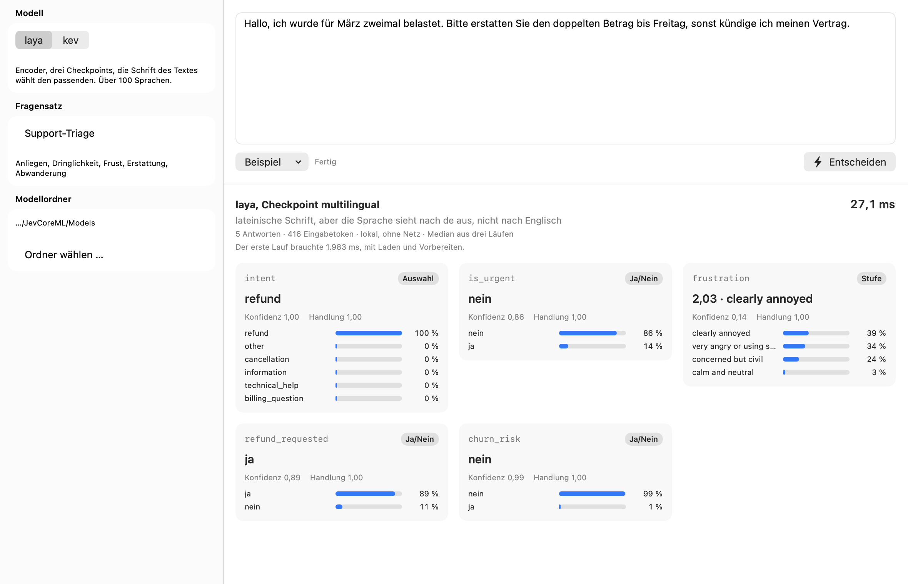

# JevCoreML

Entscheidungsmodelle als fertige Core-ML-Pakete für den Mac. Ein Text geht hinein, eine
kalibrierte Entscheidung kommt heraus: eine Auswahl, eine Stufe oder Ja/Nein, jeweils mit
Wahrscheinlichkeiten und Konfidenz. Eine Frage dauert 6 bis 10 Millisekunden, gerechnet auf der
eigenen GPU, ohne Python, ohne Server und ohne dass ein Text den Rechner verlässt.



Enthalten sind zwei Modelle, jeweils als `.mlpackage` zum Einbinden, dazu ein Swift-Paket, das
sie rechnet, eine Kommandozeile mit HTTP-Server, eine Demo-App und die Messungen, die zeigen,
dass die Pakete dasselbe antworten wie die Originale.

| | laya | kev |
|---|---|---|
| Stärke | Trefferquote, über 100 Sprachen | mehrere Fragen in einem Durchlauf |
| Aufbau | Encoder, drei Checkpoints, Router nach Schrift und Sprache | Decoder mit Pointer-Kopf |
| Eine Frage | 9,0 ms englisch, 6,0 ms deutsch | 7,5 ms für eine kurze Anfrage, bis zu acht Fragen in einem Durchlauf |
| Gegen das Original | 6- bis 12-mal schneller als laya in PyTorch | 2 von 1468 Antworten anders als kev in PyTorch, 19 statt 59 ms im Median |
| Originalgewichte | [convaiinnovations/laya](https://huggingface.co/convaiinnovations/laya) | [jaredpalmer/kev-0.6b](https://huggingface.co/jaredpalmer/kev-0.6b) |

Die Originale laufen in PyTorch. Hier sind sie nach Core ML übertragen und bis auf fp16-Rauschen
gleich: 1000 von 1000 Antworten auf AG News, 999 von 1000 auf Emotion, die eine Abweichung ein
Gleichstand zweier Klassen bei 0,4978 gegen 0,4977. Wie das geprüft ist, steht unter
[Wie genau, wie schnell](#wie-genau-wie-schnell).

## Schnellstart

Voraussetzung ist ein Mac mit Apple Silicon, macOS 15 und Xcode 16 oder neuer. Das Swift-Paket
baut auch für iOS 18 und läuft im iPhone-Simulator, dort ohne GPU: kev trifft auf allen sechs
Längen dieselben Entscheidungen wie PyTorch, die Wahrscheinlichkeiten liegen bis 0,01 daneben,
beim gepackten Mehrfragenlauf bis 0,034; laya weicht bis 0,04 ab. Auf einem echten iPhone ist
nichts gemessen, und die 1,1 GB des kev-Pakets sind dort ein anderes Kaliber als die 0,6 bis
0,8 GB je laya-Checkpoint.

```bash
git clone https://github.com/GodModeAI2025/JevCoreML.git
cd JevCoreML
scripts/fetch-models.sh              # laya, rund 2,2 GB; "kev" oder "alle" für mehr
swift build -c release
.build/release/jev --engine laya --models Models --demo --repeat 15
```

Die Demo-App liegt unter `Demo/`: `Demo/JevDemo.xcodeproj` in Xcode öffnen und starten. Sie
findet die Modelle im Ordner `Models` des Repos von selbst. Mehr in [Demo/README.md](Demo/README.md).

## In eigenen Apps

Das Swift-Paket heißt `JevDecisionKit`:

```swift
dependencies: [
    .package(url: "https://github.com/GodModeAI2025/JevCoreML", from: "1.0.0"),
]
```

Die Modelle gehören als Ressourcen ins App-Target: die `.mlpackage`-Dateien und die passenden
Tokenizer aus `Models/`. Xcode übersetzt die Pakete beim Bauen, `LayaRouted.bundled()` findet
sie im fertigen Bundle.

```swift
import JevDecisionKit

let laya = try LayaRouted.bundled()          // oder .discovering(in: ordnerMitModellen)

let result = try await laya.answer(
    state: .object([("message", .string(ticketText))]),
    questions: [
        ("team", .choice(instructions: "An welches Team geht das Ticket?", criteria: [
            (name: "billing", description: "Rechnungen, Zahlungen, Erstattungen"),
            (name: "tech", description: "Fehler, Abstürze, Ausfälle"),
        ])),
        ("dringend", .noul(instructions: "Ist das dringend?")),
        ("frust", .score(instructions: "Wie verärgert klingt der Kunde?",
                         levels: ["ruhig", "besorgt", "verärgert", "wütend"])),
    ])

print(result.checkpoint, result.reason)     // multilingual, die Sprache sieht nach de aus ...
for (id, answer) in result.answers {
    print(id, answer.answer, answer.confidence, answer.actProbability)
}
```

Fertige Fragensätze aus laya liegen als `LayaPresets` bereit: `triage()`, `email()`,
`guardrails()`, `moderation()` und `router()`. `LayaEmail.state(subject:body:)` bereitet eine
Mail so auf, wie laya es tut, ohne zitierten Verlauf und Signaturen.

kev wird genauso eingebunden, mit `SystemOne` statt `LayaRouted`:

```swift
let kev = try SystemOne(modelURL: modelsURL.appending(path: "JevCoreML.mlpackage"),
                        tokenizerURL: modelsURL.appending(path: "tokenizer.json"))
let response = try await kev.answer(JevRequest(state: ticket, questions: questions))
```

Das kev-Paket nimmt sechs Eingabelängen von 128 bis 3072 Token an, bis zu acht Fragen je
Durchlauf und 256 Optionen je Frage. Die Laufzeit rechnet jede Anfrage in der kürzesten Länge,
in die sie passt; es gibt nichts auszuwählen und nichts zu konfigurieren.

Gut zu wissen:

- **Rechenwerk.** Beide Modelle laufen auf der GPU, auch wenn `.all` angegeben ist. Bei laya
  hat die Neural Engine die ersten Exporte falsch gerechnet, die jetzigen richtig, aber 40-mal
  langsamer. Bei kev legte der Planer von Core ML das Paket mit sechs Längen unter `.all` auf
  die CPU: 394 ms statt 8 für eine kurze Anfrage. `allowNeuralEngine: true` hebt die Festlegung
  auf.
- **Erste Anfrage.** Laden und Vorbereiten dauern bei laya ein bis zwei Sekunden, bei kev rund
  4 s fürs Laden und 13 s Warmlauf, weil die GPU jede der sechs Längen einmal vorbereitet.
  `warmUp()` beim Start im Hintergrund aufrufen, dann wartet keine Anfrage darauf. Wer nur kurze
  Anfragen sieht, gibt `sequenceLengths: [128, 256, 512]` an (CLI: `--lengths`); die größte
  Länge, 3072, bleibt immer dabei, damit jede Anfrage passt, also vier Instanzen statt sechs und
  ein kürzerer Warmlauf.
- **Größe.** laya braucht je Checkpoint 0,6 bis 0,8 GB. Wer nur Englisch sieht, nimmt nur
  `Laya-EN`; fehlt ein Checkpoint, weicht der Router aus und sagt das in `reason`.
- **kev und Platte.** Ein geladenes kev-Paket legt im Temp-Verzeichnis bis zu 14 GB ab, bis der
  Prozess endet. Das Paket JevCoreML tut das einmal, nicht je Länge: die zweite Instanz lud in
  0,2 s und legte keine einzige Datei mehr an. Für eine App ist laya trotzdem die leichtere Wahl.

## Kommandozeile und HTTP-Server

```bash
.build/release/jev --engine laya --models Models --request Examples/support-triage.json
.build/release/jev --engine laya --models Models --serve --port 8008
```

```bash
curl -s localhost:8008/v1/systemone -d '{
  "state": "Der Kunde wurde zweimal belastet und will sein Geld zurück.",
  "questions": {"erstattung": {"type": "noul", "instructions": "Will der Kunde Geld zurück?"}}
}'
```

Die Antwort hat Feld für Feld die Form von `laya.Router.predict`, samt `routing` und
`action.act_probability`. `task` und `lang` in der Anfrage steuern das Routing wie in laya. Mit
`--engine kev` (die Vorgabe) spricht derselbe Server das Format von kev und der TypeSafe-API.
Die Längenwahl steckt im Paket JevCoreML selbst; `--buckets` baut dasselbe aus den drei getrennten
Zuschnitten des älteren Releases, nur noch für den Vergleich.

## Die Modelle

| Datei | Modell | Eingabelängen | Fragen | Optionen | Größe |
|---|---|---|---|---|---|
| `Laya-EN-L512-K512-fp16` | laya, english | 128, 256, 512 | 1 | 512 | 805 MiB |
| `Laya-ML-L1024-K1024-fp16` | laya, multilingual | 128 bis 1024 | 1 | 1024 | 615 MiB |
| `Laya-TD-L1024-K1024-fp16` | laya, typed-decisions | 128 bis 1024 | 1 | 1024 | 805 MiB |
| `JevCoreML` | kev-0.6b | 128, 256, 512, 1024, 2048, 3072 | 8 je Durchlauf | 256 | 1,1 GiB |

Jedes Paket nimmt mehrere Eingabelängen an, und die Laufzeit rechnet eine Anfrage in der
kürzesten, in die sie passt. laya selbst rechnet genauso nur so lang, wie eine Frage ist. Eine
laya-Frage darf so viele Optionen haben, wie in die Sequenz passen, wie im Original: 169 auf
dem englischen Checkpoint, bis 340 auf typed-decisions.

Bei kev ist das eine Paket der ganze Zuschnitt: Fragen und Optionen wirken nur im Pointer-Kopf,
also durften sie großzügig sein, ohne die Latenz zu berühren; die hängt allein an der Länge, und
die wählt die Laufzeit. Gemessen je Länge in Python über coremltools (`Exporter/verify_fanout.py`),
GPU, eine gepackte Anfrage mit zwei Fragen und 45 Token; die Swift-Laufzeit misst für die
Demo-Anfrage 7,5 ms und über kevs Suite 19 ms im Median:

| Länge | 128 | 256 | 512 | 1024 | 2048 | 3072 |
|---|---|---|---|---|---|---|
| Median | 7,2 ms | 10,9 ms | 19,7 ms | 73 ms | 151 ms | 269 ms |

Bei 512 Token sind die Logits auf der GPU bitgleich mit dem bisherigen festen Export `Kev06B-Q4-fp16`. Die
drei getrennten Zuschnitte aus dem Release `models-v1` (`Kev06B-Q4`, `Kev06B-L256-Q4`,
`Kev06B-L1024-Q4K96`) laufen weiter und liefern dieselben Zahlen.

**Zur Benennung.** Das Projekt und das kev-Paket heißen JevCoreML, weil sie die Fähigkeiten
nachbilden, die TypeSafe für Jev beschreibt. Sie sind nicht Jev. Die Gewichte im Paket sind
kev-0.6b von Jared Palmer auf Qwen3-0.6B-Base, eine unabhängige Rekonstruktion; Herkunft und
Lizenz stehen in `NOTICE` und in den Metadaten des Pakets.

## Wie genau, wie schnell

Gleich heißt hier: dieselbe gewählte Option, bei Ja/Nein dieselbe Seite von 0,5, bei Stufen
dieselbe gerundete Stufe. Darunter liegen die Zahlen um fp16-Rauschen auseinander.

| Prüfung | Ergebnis |
|---|---|
| laya, 15 Referenzanfragen je Checkpoint | 15/15 auf allen drei, max ∣Δp∣ 1,6e−03 bis 2,7e−03 |
| laya, AG News und Emotion, je 1000 Zeilen | 1000/1000 und 999/1000, Trefferquote 92,9 % und 57,8 % |
| laya über HTTP gegen `Router.predict` | 14 Anfragen in derselben Form, 26/26 Entscheidungen |
| laya, Routing nach Schrift und Sprache | 116/116 |
| kev, ganze Entwicklungssuite, 1468 Fragen | 2 abweichende Antworten, 80,79 % gegen 80,93 % in PyTorch |
| Tokenizer | laya 31 238 Fälle, kev 15 032, alle byte-identisch, dazu jeder Unicode-Codepunkt einzeln |

| Fall | Original | Core ML | Faktor |
|---|---|---|---|
| laya, 1 Frage, englisch | 112,9 ms | **9,0 ms** | 12,5× |
| laya, 4 Fragen, englisch | 314,8 ms | **33,6 ms** | 9,4× |
| laya, 1 Frage, deutsch | 37,4 ms | **6,0 ms** | 6,2× |
| kev, Entwicklungssuite über HTTP, 1468 Fragen | 59 ms | **19 ms** | 3,1× |

Gemessen auf einem M5 Max. laya im Original läuft als PyTorch auf der CPU, so wie es sich selbst
misst; kev im Original als `kev.serve` in PyTorch auf der GPU, der Port mit `JevCoreML.mlpackage`
über den eigenen HTTP-Server (Median 19 ms, p95 75 ms; mit den drei getrennten Buckets waren es
22,7 ms, mit einem festen L=1024-Export 70,3 ms, bei denselben 1468 Antworten). Gegen den
Cloud-Dienst Jev 1.13, der auf kev beruht, kommt der Port auf Banking77 mit 77 Kategorien auf
dieselbe Trefferquote, 78,8 %, in 70 statt 320 ms und ohne Kosten je Aufruf.
Alles Weitere, Rohdaten und Skripte in [Benchmarks/README.md](Benchmarks/README.md), die
ausführlichen Berichte unter `docs/`:

| Bericht | Inhalt |
|---|---|
| [docs/laya-port.md](docs/laya-port.md) | laya: Vertrag, Gleichheit, Geschwindigkeit, HTTP-Dienst, was beinahe schiefging |
| [docs/benchmark.md](docs/benchmark.md) | kev und laya: Parität, Tempo, Vergleich mit den veröffentlichten Jev-Zahlen |

## Aufbau

```
Sources/JevDecisionKit/   das Swift-Paket: Tokenizer, Laufzeiten, Router, Server
Sources/jev/              Kommandozeile und HTTP-Server
Tests/                    102 Tests gegen Referenzdaten aus den Originalen
Models/                   die Core-ML-Pakete, geladen mit scripts/fetch-models.sh
Demo/                     macOS-App in SwiftUI
Benchmarks/               Messergebnisse als JSON
docs/                     Berichte und die Landingpage
Exporter/                 Python: Umwandlung nach Core ML und Prüfung gegen die Originale
Golden/                   Referenzdaten aus den Originalen, gegen die die Tests prüfen
scripts/                  Modelle laden, packen, selbst bauen
```

```bash
swift test                  # 102 Tests; die Pool-Tests brauchen zusätzlich die drei Zuschnitte aus models-v1
```

## Selbst bauen

Wer die Pakete nicht herunterladen, sondern aus den Originalgewichten erzeugen will:
`scripts/reproduce.sh` richtet die Python-Umgebung ein, lädt die Originale, wandelt um und prüft
jede Stufe gegen PyTorch. Das braucht [uv](https://docs.astral.sh/uv/), rund 20 GB Platz und
etwa eine Stunde. Für das Benutzen ist es nicht nötig. `scripts/package-models.sh` packt
fertige Pakete für ein Release.

## Lizenz

Apache License 2.0, siehe [LICENSE](LICENSE). Die Modelle sind Umwandlungen der Gewichte von
kev-0.6b (Jared Palmer, Apache 2.0, auf Qwen3-0.6B-Base) und laya (ConvAI Innovations,
Apache 2.0, auf ModernBERT und mmBERT) und stehen unter deren Lizenzen. Herkunft und Änderungen
im Einzelnen: [NOTICE](NOTICE).
